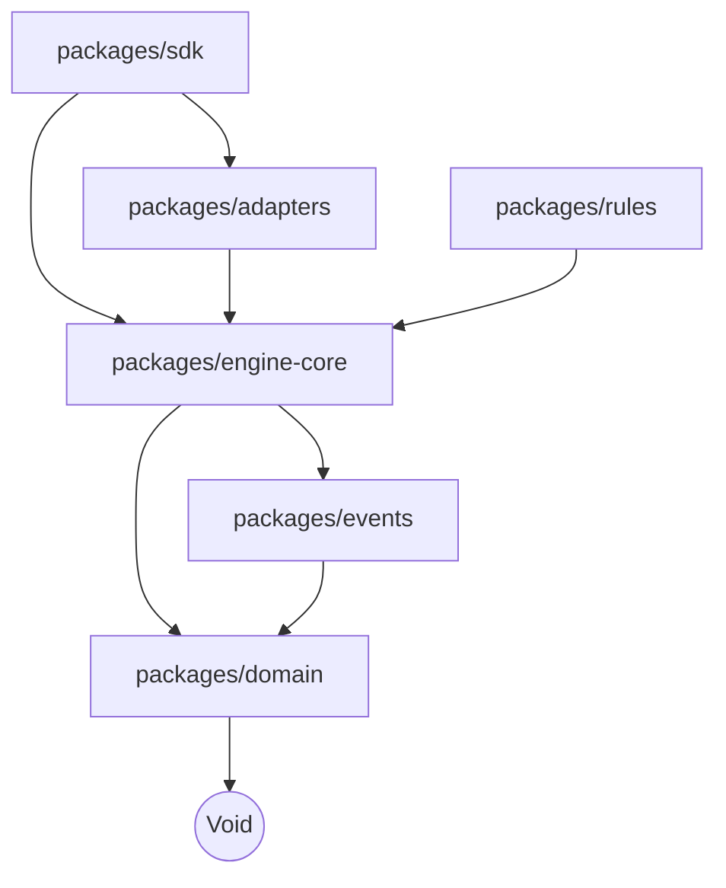

# Temify: Headless Gamification Engine

> **Phase 3.5: Scaffolding**
> Warning: This repository is currently in the scaffolding phase. Contains structure and types only.

## 🌟 Overview
Temify is an open-source, headless, event-driven gamification engine designed for the modern web. It provides the mathematical and logical core for gamification (XP, Levels, Badges, Leaderboards) without tying you to a specific UI framework or database.

## 🧘 Philosophy
- **Headless**: We give you the data; you build the UI.
- **Event-Driven**: Every action produces an event. Hook into them to power animations, notifications, or analytics.
- **Deterministic**: The same series of actions will always result in the same state.
- **Agnostic**: Works with SQL, NoSQL, In-Memory, REST, GraphQL, React, Vue, Svelte, CLI.

## 🏗 Architecture
This project is a monorepo managed by npm workspaces.

### Modules
- **`@temify/domain`**: Pure data shapes and types.
- **`@temify/events`**: System events (LevelUp, AchievementUnlocked).
- **`@temify/engine-core`**: The execution engine contracts and state management.
- **`@temify/rules`**: Definitions for rules and constraints.
- **`@temify/adapters`**: Contracts for external systems (Persistence, PubSub).
- **`@temify/sdk`**: The developer-facing library.

## 🚀 Roadmap
- [x] Phase 0-2: Research & Design
- [x] Phase 3.5: Project Scaffolding
- [ ] Phase 4: Core Engine Logic
- [ ] Phase 5: Storage & Event Adapters
- [ ] Phase 6: SDK Implementation
- [ ] Phase 7: Plugins & Ecosystem

## 📦 content
This repo currently contains:
- **Type Definitions**: Interfaces for the entire system.
- **Package Structure**: The Skeleton for the engine.
- **Strict Configuration**: Compilation and linting rules.

## 🚫 Non-Goals (Currently)
- UI Components (React/Vue libraries are separate projects).
- Hosted Service (This is a library).
- HTTP API (You wrap this engine in your own API).

## 🤝 Contributing
Contributions are welcome, but please read `AGENT_CONTEXT.md` first.
We enforce strict architectural boundaries.
1. No logic in `domain`.
2. No circular dependencies.
3. No UI code.

## 📄 License
MIT © Temify Contributors
